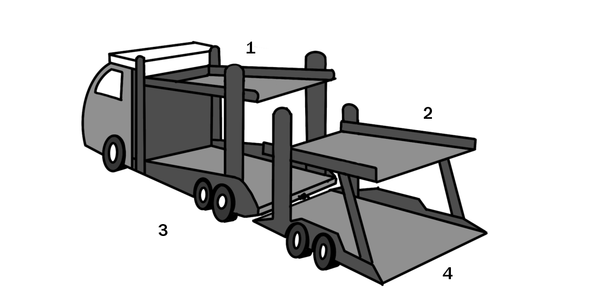
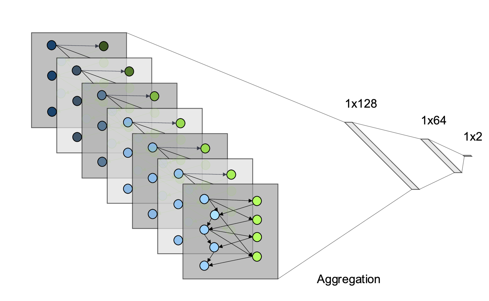
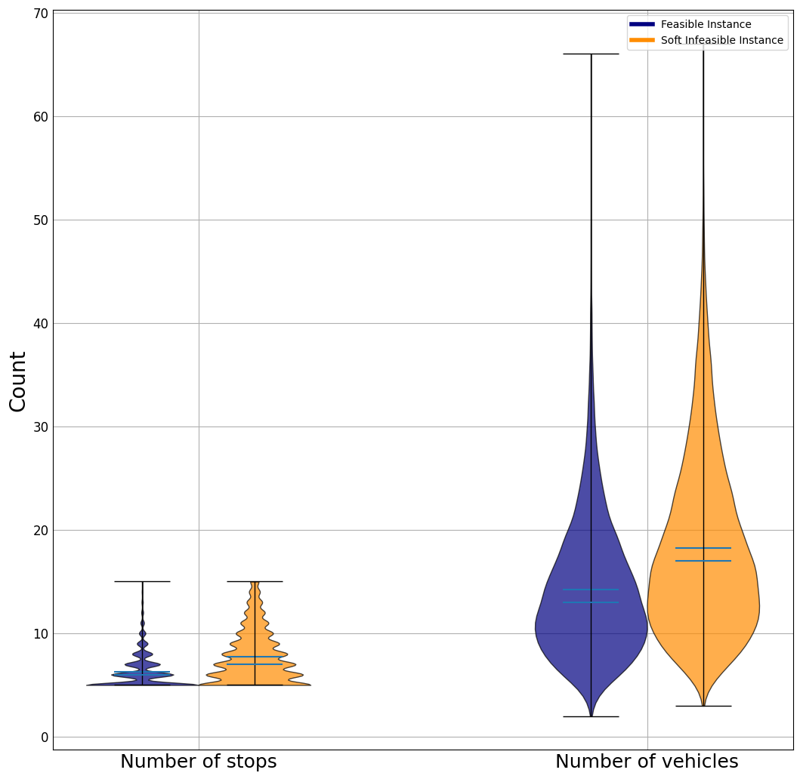
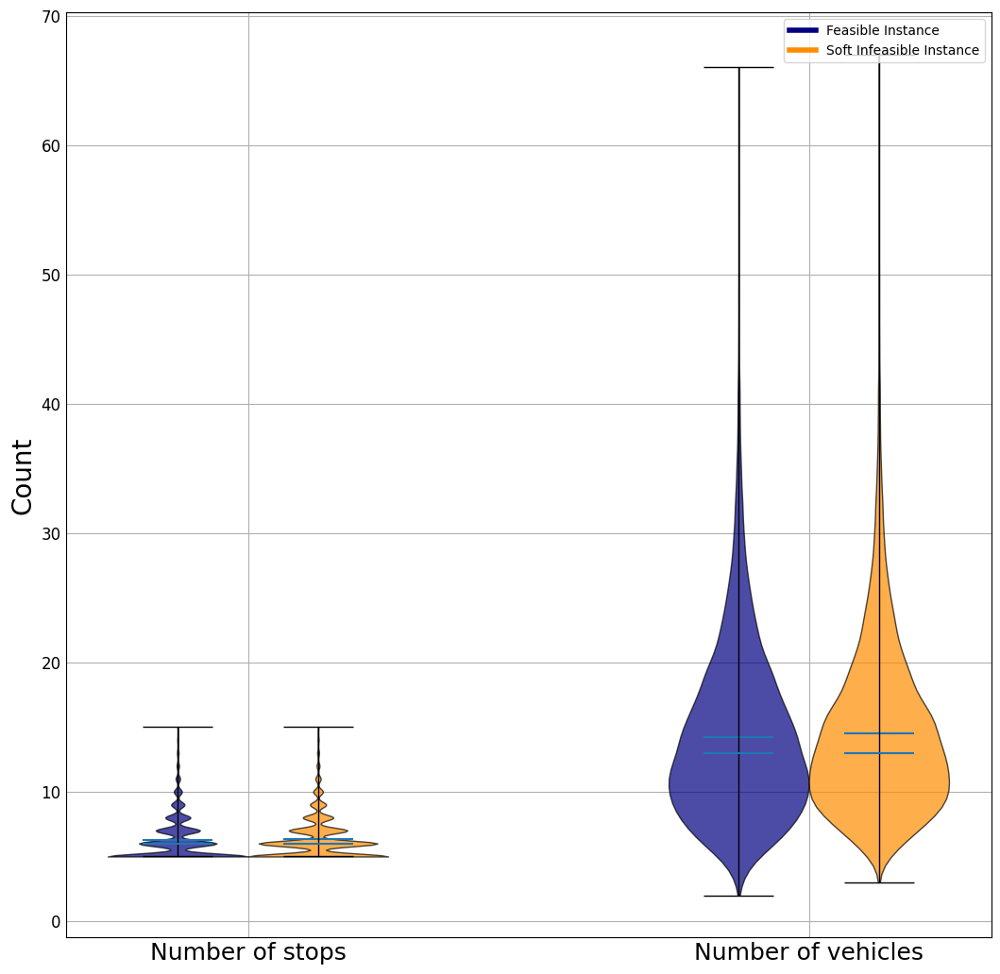
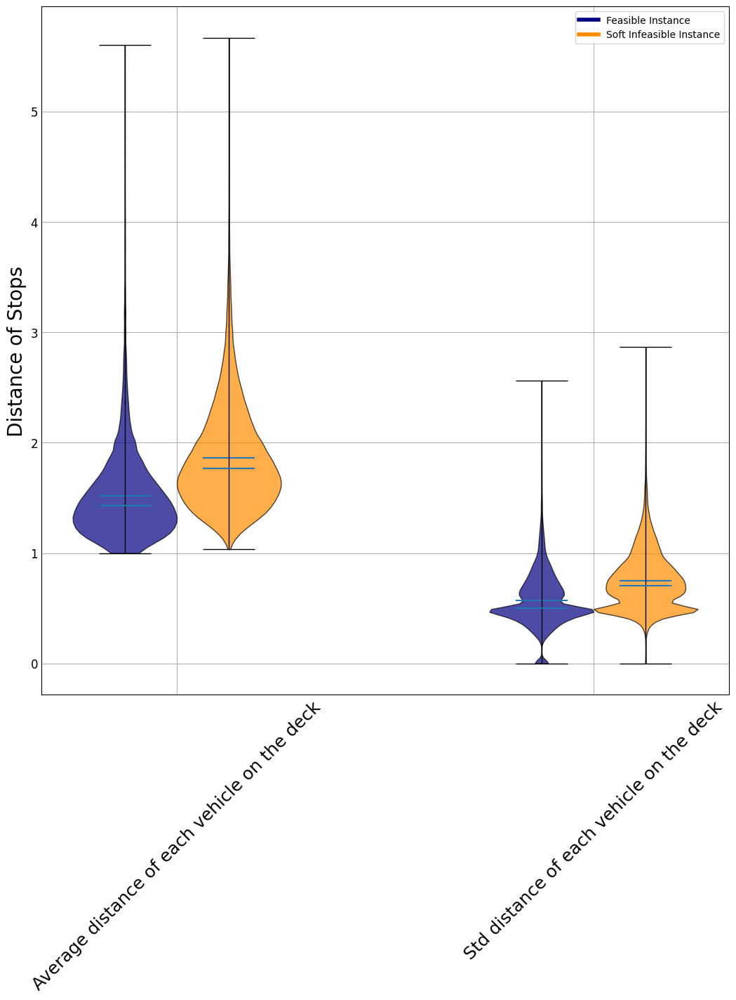
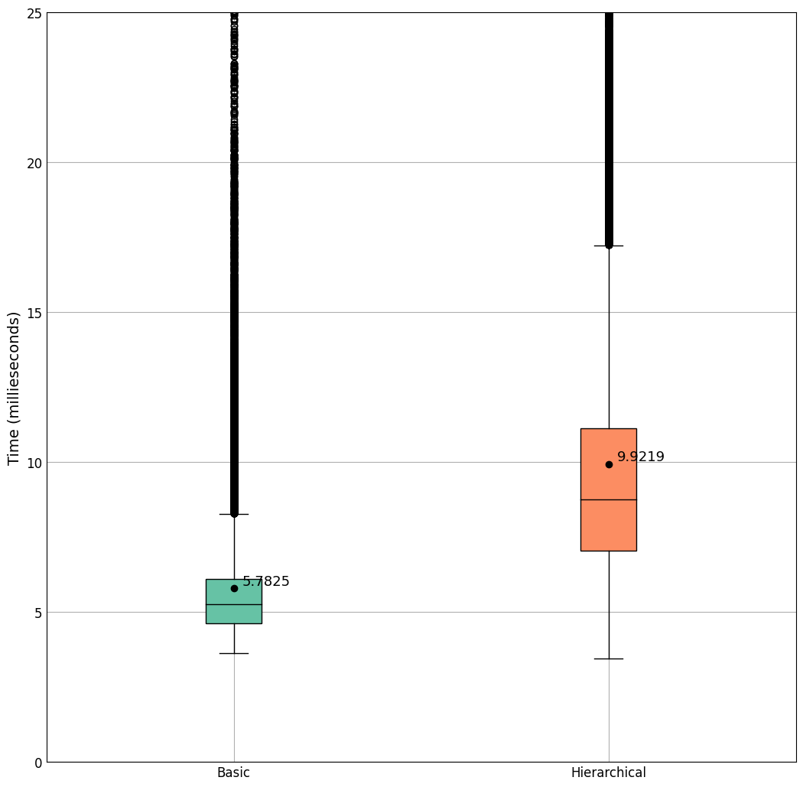
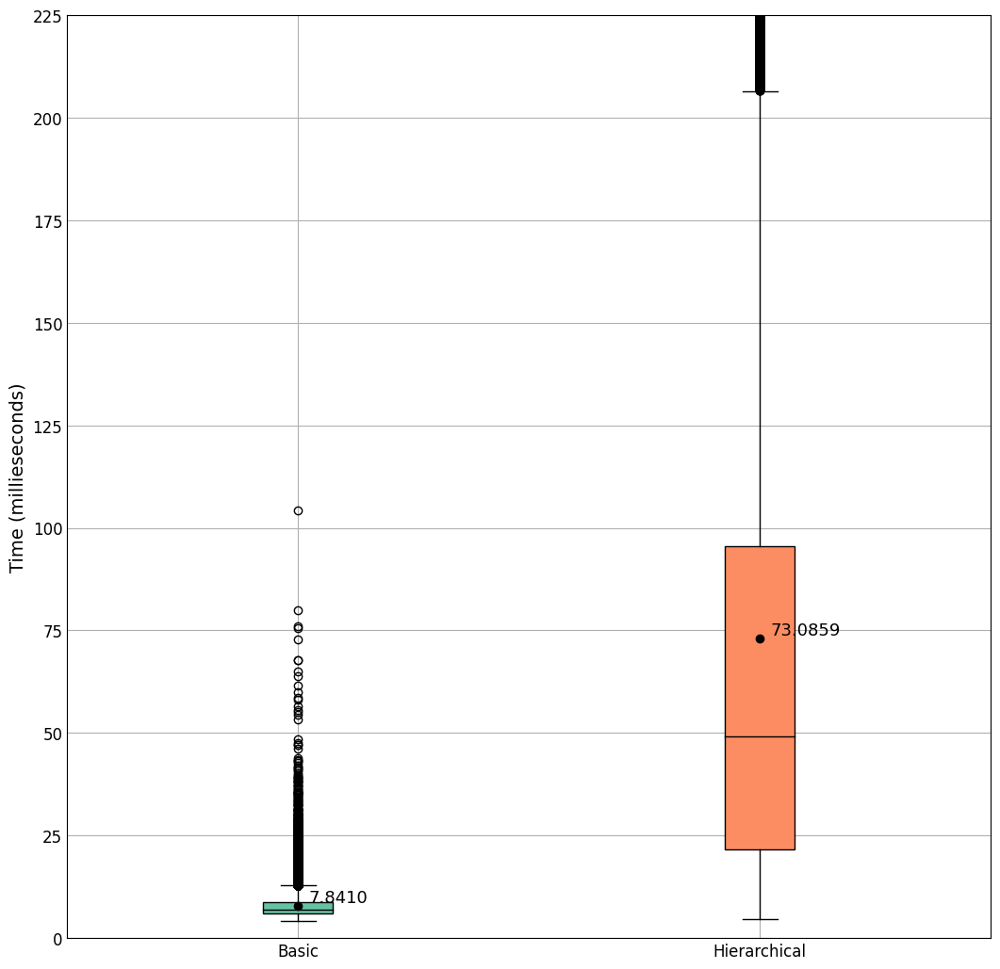

# GNN Feasibility Screening for the Car Transporter Loading Problem

MSc dissertation project (University College London / Satalia, 2024).

This repository investigates using **Graph Neural Networks (GNNs)** to pre-screen
instances of the **Car Transporter Loading Problem (CTLP)** for feasibility, before
passing them to an expensive combinatorial optimisation solver. The best model
(HEATConv + attentional pooling on the Hierarchical graph) achieves **~86% accuracy**
and **~0.93 AUC** on held-out test data.

---

## The Problem

A car transporter visits a sequence of stops. At each stop some vehicles are loaded
onto one of three layered decks (d1 / d2 / d3) and some vehicles are unloaded.
A loading plan is **feasible** if:

- deck capacity constraints are never violated at any stop, and
- deck access constraints are respected (vehicles on higher decks cannot be removed
  while vehicles below them are still on the transporter).

Checking feasibility with a full solver is expensive. The GNN acts as a fast
**pre-filter**: instances classified as infeasible skip the solver entirely.



---

## Repository Structure

```
├── src/
│   ├── data_preprocessing.py   # JSON → NetworkX graph (4 representations)
│   ├── graph_encoding.py       # Node/edge feature tensors for torch_geometric
│   ├── models.py               # GNN model class definitions (GCN, GAT, HEAT, …)
│   ├── train.py                # 4-fold cross-validation training loop
│   ├── evaluate.py             # Inference + metrics on a saved model
│   └── eda.py                  # EDA visualisation functions
├── data/
│   ├── raw/                    # Sample .json problem instances
│   ├── 100K_instances/         # 100K feasible + infeasible instances (gitignored)
│   └── 1M_instances/           # 1M instances (gitignored)
├── models/                     # Saved model weights (.pth)
├── notebooks/                  # Jupyter notebooks
├── tests/
│   └── MIP_feasibility_check.ipynb  # MIP baseline feasibility checker
├── archive/                    # Early exploration scripts (not used in paper)
├── requirements.txt
└── README.md
```

---

## Graph Representations

Four ways to encode a CTLP instance as a graph were evaluated. Each adds richer
structural information at the cost of larger graphs.

| Name | Code | Nodes | Edge types |
|---|---|---|---|
| **Basic** | `v2_weight` | Stop nodes + vehicle nodes | next · load · unload |
| **Deck Assign** | `v3_3_weight` | + shared deck nodes (d1/d2/d3) | + via · applicable |
| **Deck Co-use** | `v3_4_weight` | Same as above | + load via (stop→deck) |
| **Hierarchical** | `v5_weight` | + per-vehicle deck-access trees | same as Deck Co-use |

**Node features** (3 or 4 dimensions):
- One-hot node type: `[is_stop, is_vehicle]` (v2) or `[is_stop, is_vehicle, is_deck]`
- Scalar representation: remaining capacity (stops) / vehicle dimension / deck capacity

**Edge features** (4 or 6 dimensions):
- Edge weight (1 scalar)
- One-hot action type (3-class for v2, 5-class for v3_3 / v3_4 / v5)

---

## Model Architectures

All models are graph-level binary classifiers (feasible / infeasible) implemented
in PyTorch Geometric.

| Family | Module | Description |
|---|---|---|
| **GCN** | `GraphConv` | 3-layer graph convolution |
| **GAT** | `GATConv` | Graph attention (4 heads) |
| **GATv2** | `GATv2Conv` | Improved attention; up to 7 layers |
| **Transformer** | `TransformerConv` | Transformer-style message passing |
| **HEATConv** | `HEATConv` | Heterogeneous Edge-type Aware Transformer |

**Pooling strategies**: global mean pooling (`_mean`) or attentional aggregation (`_att`).

**Node feature variants**: raw hand-crafted features (`_raw`) or Node2Vec embeddings (`_n2v`).



---

## Dataset Analysis

The training dataset contains 1M problem instances (feasible + soft-infeasible).
Infeasible instances are selected by **greedy nearest-neighbour matching** in
standardised feature space so that the two classes share the same structural
distribution — preventing the model from exploiting trivial size differences.

### Graph structure: nodes and edges

Feasible and soft-infeasible instances have very similar node/edge count
distributions, confirming that size alone cannot distinguish the two classes.


### Stop and vehicle count: random vs. stratified sampling

Random sampling (left) leaves a distributional gap in vehicle count between the
two classes. Nearest-neighbour stratified sampling (right) closes that gap,
forcing the GNN to learn structural feasibility rather than a size shortcut.

| Random sampling | Stratified (nearest-neighbour) sampling |
|:---:|:---:|
|  |  |

### Vehicle stay duration on deck

Infeasible instances tend to have a slightly longer average stay per vehicle
(more stops on deck), reflecting tighter packing that strains deck-access constraints.



### Unloading edge count

The number of unloading events is comparable between feasible and infeasible
instances, confirming that global trip structure is not the distinguishing signal.


---

## Results

Best configuration: **HEATConv + attentional pooling + Hierarchical (v5) graph**,
trained on balanced 1M-instance dataset (feasible + soft-infeasible), 4-fold CV.

| Graph | Accuracy | Precision | Recall | F1 | FPR | FNR |
|---|---|---|---|---|---|---|
| Basic (v2) | 0.854 | 0.879 | 0.820 | 0.848 | 0.113 | 0.180 |
| Hierarchical (v5) | **0.862** | 0.857 | **0.870** | **0.863** | 0.146 | 0.130 |

ROC-AUC reaches **~0.93** for the Hierarchical graph.

---

## Processing Time

End-to-end screening time was measured on 1M instances (pre-processing + inference).
The Basic graph is fastest due to its smaller node/edge count; the Hierarchical graph
trades speed for ~1% higher accuracy.

### Inference time only (milliseconds)

Basic mean: **5.78 ms** · Hierarchical mean: **9.92 ms**



### Total time — pre-processing + inference (milliseconds)

The Hierarchical graph's richer structure increases pre-processing cost
(mean ~73 ms vs ~8 ms for Basic), but both remain orders of magnitude faster
than invoking the combinatorial solver.



---

## Setup

**Requirements**: Python 3.10+, PyTorch 2.0+, CUDA optional.

```bash
pip install -r requirements.txt
```

For PyTorch Geometric with CUDA support, follow the official installation guide
at https://pytorch-geometric.readthedocs.io/en/latest/install/installation.html
before running `pip install -r requirements.txt`.

**Data**: Raw instances are not included in the repository (too large). Place your
JSON instance files under:

```
data/
├── 1M_instances/
│   ├── feasible/       # feasible .json instances
│   └── soft/           # soft-infeasible .json instances
└── 100K_instances/
    ├── feasible/
    └── infeasible/
```

Pre-processed `.pt` tensor files (one per instance) go in:

```
data/processed/
├── feasible/raw_1M/v5/
└── infeasible/raw_1M/v5/
```

---

## Usage

### Pre-process instances into graph tensors

```python
from src.data_preprocessing import read_json_file, json_to_graph_v5_weight
from src.graph_encoding import (
    edge_index_extractor, edge_weight_extractor,
    edge_att_extractor, node_feature_raw_v5,
)
import torch
from torch_geometric.data import Data

raw = read_json_file('data/1M_instances/feasible/instance_001.json')
G = json_to_graph_v5_weight(raw)

node_features = node_feature_raw_v5(G)
edge_idx = edge_index_extractor(G)
edge_w = edge_weight_extractor(G)
edge_att = edge_att_extractor(G)
edge_feature = torch.cat([edge_w.unsqueeze(1), edge_att], dim=1)
node_type = torch.argmax(node_features[:, :3], dim=1)
edge_type = torch.argmax(edge_att, dim=1)

data = Data(
    x=node_features, edge_index=edge_idx, y=torch.tensor([1]),
    edge_weight=edge_w, edge_attr=edge_att, edge_feature=edge_feature,
    node_type=node_type, edge_type=edge_type,
)
torch.save(data, 'data/processed/feasible/raw_1M/v5/instance_001.pt')
```

### Train a model

```bash
python src/train.py \
    --feasible-dir  data/processed/feasible/raw_1M/v5/ \
    --infeasible-dir data/processed/infeasible/raw_1M/v5/ \
    --model HeatConv_raw_att \
    --epochs 100 \
    --batch-size 512 \
    --folds 4 \
    --save-path models/my_model.pth
```

All available `--model` choices (defined in `src/models.py`):

```
GCN_raw_mean  GCN_raw_att  GCN_n2v_att  GCN_n2v_mean
GAT_raw_mean  GAT_raw_att  GAT_n2v_mean
GATv2_raw_mean  GATv2_raw_att  GATv2_n2v_mean
Transformer_raw_mean  Transformer_raw_mean_v2  Transformer_raw_att  Transformer_raw_att_v2
HeatConv_raw_mean  HeatConv_raw_att  HeatConv_raw_mean_v2  HeatConv_raw_att_v2  HeatConv_raw_set_v2
```

### Evaluate a saved model

```bash
python src/evaluate.py \
    --model-path models/v5_HEAT_att_late.pth \
    --feasible-dir  data/1M_instances/feasible/ \
    --infeasible-dir data/1M_instances/soft/ \
    --graph-version v5 \
    --save-roc data/processed/performance_matrix/roc_pr_data_v5.npz
```

### Run EDA

```bash
python src/eda.py \
    --feasible-dir   data/1M_instances/feasible \
    --infeasible-dir data/1M_instances/soft \
    --graph-version  v5 \
    --plots nodes_edges stop_vehicle load_distance accuracy_comparison fold_variance
```

---

## Key Design Decisions

- **Balanced dataset**: Infeasible instances are selected by greedy nearest-neighbour
  matching in standardised feature space to match the number of feasible instances.
  This prevents the classifier from exploiting trivial distributional differences.

- **HEATConv** is well-suited to this problem because it jointly embeds node types
  (stop / vehicle / deck) and edge types (next / load / via / applicable), allowing
  the model to reason about the heterogeneous semantics of the CTLP graph.

- **GraphNorm** (rather than BatchNorm) is used inside HEATConv layers because
  CTLP graphs vary significantly in size, making batch normalisation unstable.

---

## Citation

If you use this work, please cite:

> Sheng-Yi Cheng. *Graph Neural Networks for Feasibility Screening in the Car Transporter Loading Problem*. MSc Dissertation, University College London, 2024.
